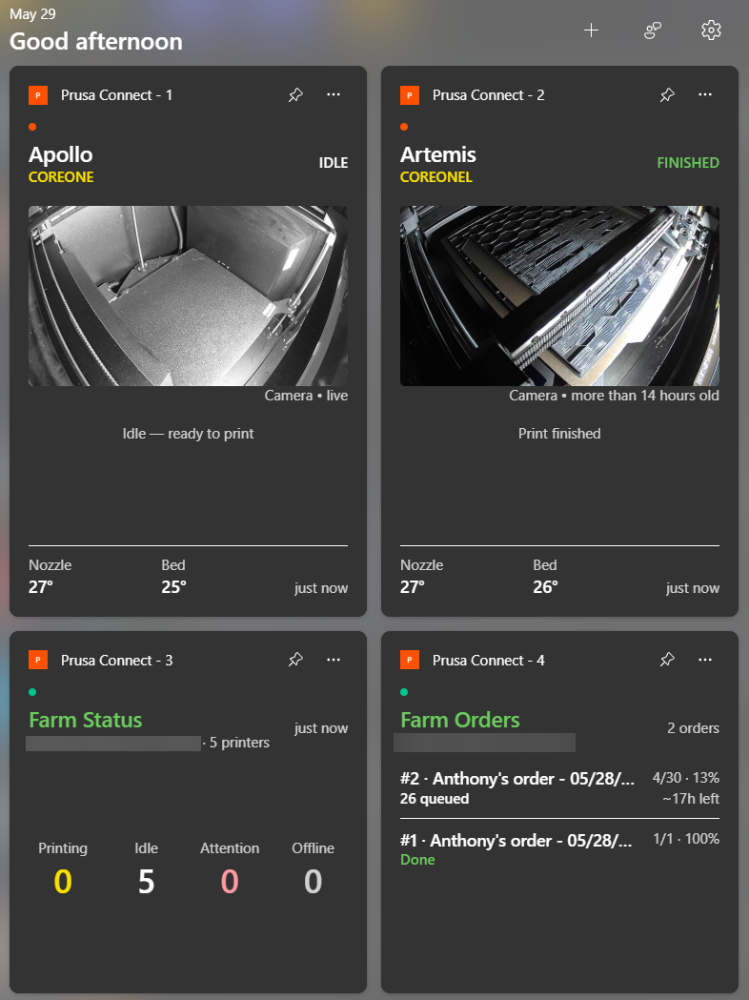

# Prusa Connect Widget

A Windows 11 widget for keeping an eye on my Prusa printers without leaving a
Connect tab open in the browser. Pin a tile to the Widgets Board, tell it which
printer (or team, or farm order queue) to watch, and it updates itself.

I made it because I'd never seen an app actually use the Windows Widgets panel,
so I figured I'd find out what it'd take to shove Prusa Connect into it. It
reuses the Prusa Connect login PrusaSlicer already stores, so there's no separate
account to set up - if you're signed into Connect in PrusaSlicer, it just works.



Setup walkthrough: [docs/SETUP.md](docs/SETUP.md).

## What a tile can show

Every tile starts blank until you set it in the settings app. Pick one of:

- **Printer status** - a single printer: state, nozzle/bed temps, current file,
  time left.
- **Team status** - printing / idle / attention / offline counts for a regular
  Prusa Connect team. No Connect Farm needed.
- **Farm status** - the same fleet summary for a Connect Farm organization.
- **Farm orders** - the order queue for a Connect Farm team, with per-order
  progress, ETA, and which printers are running each one right now.

Printer status works with **Prusa printers** (PrusaLink on the LAN, or imported
from Prusa Connect) and **Klipper printers via Moonraker** - including the Prusa
HT90. Point it at the printer's host, pick the connection type, and optionally
give it a `/webcam/snapshot` URL for the camera.

Tiles come in small, medium, and large; each kind fills the space it's given.

## Heads up

This is an early build. A couple of things to know:

- It's **sideloaded** - signed with my own dev certificate, not a Store
  identity - so you trust the cert once and then install the package.
- Windows only reliably keeps about **four** tiles pinned per app, so the app
  ships exactly four slots. To watch more printers than that, point one tile at
  a Team or Farm summary and spend the rest on the printers you care about most.
- If tiles ever go blank or stop updating, it's almost always the board host
  needing a restart or the Connect token expiring (open PrusaSlicer to refresh
  it). The fixes are in the setup walkthrough.

## Built with

C# on .NET 8, packaged as a single-project MSIX. The widget provider is a
COM-activated class; the settings window is WinUI 3; tile content is Adaptive
Cards rendered by the Windows host. The only dependency outside the .NET SDK is
the Windows App SDK (1.6).

## Install

Trust the certificate once, then install the package:

```powershell
cd artifacts\msix\PrusaConnect.Widget_<version>_x64_Debug_Test
powershell -ExecutionPolicy Bypass -File .\Install.ps1
```

The script adds the cert to the machine's trusted store and installs the MSIX.
The full step-by-step - importing printers, pinning and configuring tiles - is
in [docs/SETUP.md](docs/SETUP.md).

## Build

You need the .NET 8 SDK and the Windows App SDK build tools (restored on build).
From the repo root:

```powershell
dotnet build src\Widget\PrusaConnect.Widget.csproj -c Debug -p:Platform=x64
```

The installable package lands in
`artifacts\msix\PrusaConnect.Widget_<version>_x64_Debug_Test\`. Signing uses the
certificate thumbprint in `src\Widget\PrusaConnect.Widget.csproj`; swap it for
one in your own certificate store to build under a different cert.

## License

OCL v1.1 + SWAtt v1 - see [LICENSE](LICENSE).

---

Not affiliated with or endorsed by Prusa Research. "Prusa", "Prusa Connect", and
"PrusaSlicer" are their trademarks; this just talks to their stuff.
